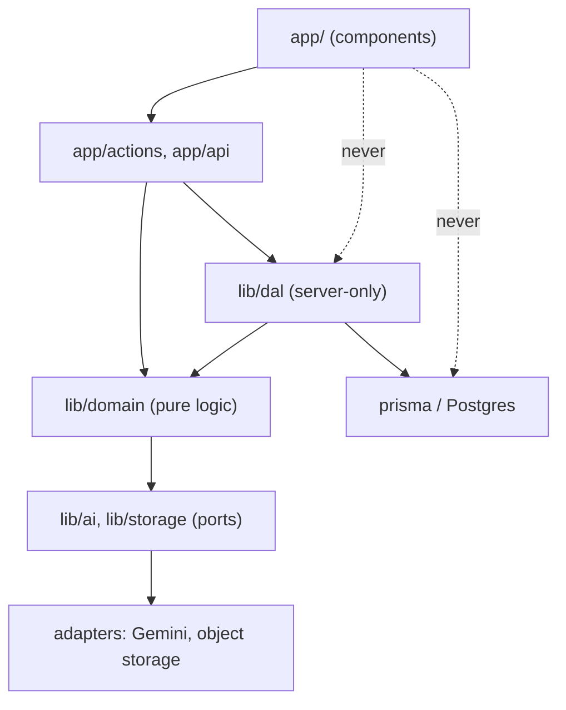
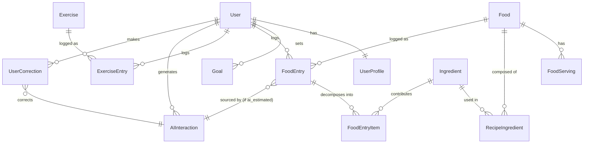

# Architecture Spine — FitMind AI

## Design Paradigm

**Layered Next.js App Router with a server-only Data Access Layer (DAL) as the single data + authorization choke point, and ports-and-adapters for external services (AI, later object storage).**

Layer → directory map:

| Layer | Directory | Responsibility |
| --- | --- | --- |
| Presentation | `app/` (Server Components + thin Client Components) | Rendering, forms, optimistic UI. No direct DB access. |
| Actions/Handlers | `app/actions/*.ts`, `app/api/**/route.ts` | Entry points for mutations/queries; validate → call DAL. |
| Data Access Layer | `lib/dal/` (`server-only`) | Auth + ownership checks, DB access, returns DTOs (never raw records). |
| Domain services | `lib/domain/` | Pure business logic: nutrition calc, target/BMR formulas, safety ladder. |
| Ports & adapters | `lib/ai/`, `lib/storage/` | Provider-agnostic interfaces + concrete adapters (Gemini, etc.). |
| Persistence | `prisma/` | Schema, migrations, seed. |

## Invariants & Rules

### AD-1 — Server-only DAL is the sole data + authorization choke point
- **Binds:** all
- **Prevents:** scattered/duplicated auth & ownership checks; leaking raw ORM records; component-level DB drift.
- **Rule:** All DB reads/writes go through `lib/dal/` modules marked `server-only`. Every DAL function performs authentication + resource-ownership checks internally and returns minimal DTOs, never Prisma entities. Components and actions never import Prisma directly.

### AD-2 — All mutations are validated Server Actions (or Route Handlers) [ADOPTED]
- **Binds:** all write FRs
- **Prevents:** unauthenticated/unvalidated mutations (every server action is a public POST).
- **Rule:** Each mutation lives in `app/actions/*.ts`, and performs, in order: (1) Zod input validation, (2) authentication, (3) authorization/ownership, before any effect. Route Handlers are used only when a non-action HTTP surface is required (e.g., Better Auth, webhooks, future mobile/API).

### AD-3 — Nutrition source of truth is the curated DB; AI never invents stored numbers
- **Binds:** FR-6, FR-7, FR-10, FR-11
- **Prevents:** silent false precision; untraceable nutrition values.
- **Rule:** Every nutrition value on a Food Entry carries `dataSource ∈ {database, ai_estimated}` and, when `ai_estimated`, a `confidence`. Composite dishes are computed bottom-up by summing Ingredient contributions. AI selects/decomposes/matches and may estimate only when no DB match exists; estimates are always labeled.

### AD-4 — AI access is through a provider-agnostic port; all AI output is schema-validated
- **Binds:** FR-6, FR-11, FR-17, FR-18
- **Prevents:** provider lock-in; consuming malformed/unsafe AI output.
- **Rule:** All AI calls go through the `AiProvider` interface in `lib/ai/`. Concrete adapters (v1: Gemini) are swappable via config. Every AI response is parsed against a Zod schema before use; a validation failure fails safe (no persisted entry; user prompted to retry or enter manually).

### AD-5 — AI safety guardrails run before any AI text is shown or stored
- **Binds:** FR-5, FR-17
- **Prevents:** medical advice, medication/supplement recommendations, guilt/judgmental language, unsafe claims.
- **Rule:** AI-generated user-facing text passes a guardrail check (system-prompt constraints + output check) before display/persist; violations are blocked/regenerated. The system never diagnoses or recommends medication; it advises professional consultation where appropriate.

### AD-6 — Authentication via Better Auth with DB-backed sessions [ADOPTED]
- **Binds:** FR-1, FR-2, FR-3, FR-30
- **Prevents:** third-party custody of health identity; delayed session revocation.
- **Rule:** Auth uses Better Auth (email/password) with sessions stored in Postgres; the session token is validated against the DB per request; deleting the session row revokes access immediately. Passwords are only ever stored hashed.

### AD-7 — Every domain row is user-owned and access is user-scoped
- **Binds:** all data FRs, FR-3, FR-31
- **Prevents:** cross-user data leakage; orphaned data.
- **Rule:** Every user-owned table has a non-null `userId` FK. All DAL queries filter by the authenticated `userId`. A request for another user's row returns not-found/forbidden — never another user's data.

### AD-8 — Soft-delete + auditability for AI-produced values and corrections
- **Binds:** FR-9, FR-19, FR-20
- **Prevents:** losing provenance/audit trail; hard-losing user-recoverable data.
- **Rule:** User-facing content tables use soft-delete (`deletedAt`) where recovery matters (Food/Exercise entries). Every `ai_estimated` entry links to an `AIInteraction`; every edit of an AI value writes a `UserCorrection` (before/after, timestamp). Account deletion (FR-3) is the exception: it hard-removes personal health data. [ASSUMPTION: retention of anonymized audit rows resolved with privacy policy.]

### AD-9 — No sensitive health/PII data in logs or error messages
- **Binds:** FR-31, all
- **Prevents:** health-data leakage via observability.
- **Rule:** Logging uses a redaction layer; health/body/PII values are never logged. Errors returned to clients are generic; details are logged server-side without sensitive payloads.

### AD-10 — Time is stored in UTC; the "day" is computed in the user's profile timezone
- **Binds:** FR-12, FR-15
- **Prevents:** entries landing on the wrong day; dashboard/date bugs across timezones.
- **Rule:** All timestamps persist as UTC (`timestamptz`). Day-boundary aggregation (dashboard, targets) uses the User Profile timezone. Late-night entries resolve to the correct local day.

### AD-11 — Canonical units in storage; convert at the edges
- **Binds:** FR-4, FR-6, FR-13, FR-14, FR-15
- **Prevents:** unit drift (kg/lb, cm/in, kcal) across features.
- **Rule:** Persist canonical units (mass in grams, energy in kcal, length in cm). Convert to the User's preferred units only at input parsing and display.

### AD-12 — Offline instant-path is client-cached; smart-path reconciles on reconnect
- **Binds:** FR-16
- **Prevents:** blocking logging on a weak network; lost/duplicated offline entries.
- **Rule:** The PWA caches recently-used/DB foods (service worker + local store) for no-AI logging offline. Offline writes queue with a client-generated idempotency key and reconcile server-side on reconnect (idempotent upsert).

### AD-13 — Uniform ID, error, and result conventions across actions
- **Binds:** all
- **Prevents:** inconsistent identifiers and error handling that downstream units would implement differently.
- **Rule:** Primary keys are UUID/CUID (single scheme, chosen at init and used everywhere). Server Actions return a typed result envelope `{ ok: true, data } | { ok: false, error }`; validation errors are field-keyed. No throwing across the action boundary for expected errors.

**Dependency direction (who may depend on whom):**



## Consistency Conventions

| Concern | Convention |
| --- | --- |
| Naming — entities | `PascalCase` Prisma models; DTOs suffixed `Dto`; ports suffixed `Provider` (e.g. `AiProvider`). |
| Naming — files | `kebab-case` files; actions grouped by feature in `app/actions/<feature>.ts`; DAL in `lib/dal/<entity>.ts`. |
| Data — ids | Single scheme (UUID or CUID) chosen at init; `id` PK on every table; FKs `<entity>Id`. |
| Data — dates | `timestamptz` in UTC; ISO-8601 at API edges; `createdAt`/`updatedAt` on every table; `deletedAt` where soft-delete applies. |
| Data — error shape | Typed result envelope `{ ok, data | error }`; field-keyed validation errors. |
| Validation | Zod schemas colocated per action/AI call; shared schemas in `lib/schemas/`. |
| State & mutation | Mutations only via Server Actions through DAL; `useOptimistic`/`useActionState` for UI; `revalidateTag`/`updateTag` after writes. |
| Auth | `requireSession()` in DAL; middleware is defense-in-depth, not the sole guard. |
| Logging/config | Redacted structured logs (AD-9); config via env vars only; no secrets in code. |

## Stack

*Seed — verified current at authoring (2026-07); the code owns exact patch versions once it exists.*

| Name | Version |
| --- | --- |
| Next.js (App Router, Turbopack) | 16.x |
| React | 19.x |
| TypeScript | 5.x |
| Tailwind CSS | 4.x |
| UI components | shadcn/ui (Radix-based) [ASSUMPTION: confirm at init] |
| PostgreSQL | 16/17.x |
| Prisma ORM | 6.x |
| Better Auth | 1.x |
| Zod (validation) | latest stable |
| AI provider (v1 adapter) | Google Gemini (via provider-agnostic port) |
| PWA | service worker + web app manifest |
| Charts (Phase 2) | Recharts or Visx [DEFERRED] |

## Structural Seed

```text
fitmind-ai/
  app/
    (auth)/            # sign-in, register, reset — Better Auth surfaces
    (app)/             # authenticated app shell
      dashboard/       # Home / net-calorie dashboard (FR-15)
      log/             # quick food entry + review (FR-6..12)
      exercise/        # exercise entry (FR-13,14)
      goals/           # profile-derived targets + safety ladder (FR-4,5)
      settings/        # units, privacy/consent, account deletion, export
    actions/           # server actions grouped by feature (AD-2)
    api/
      auth/[...all]/   # Better Auth route handler
  lib/
    dal/               # server-only data access + authorization (AD-1,7)
    domain/            # nutrition calc, BMR/TDEE, safety ladder (pure)
    ai/                # AiProvider port + gemini adapter + zod schemas (AD-4,5)
    storage/           # object-storage port (Phase 2 photos)
    schemas/           # shared zod schemas
    logging/           # redaction layer (AD-9)
  prisma/
    schema.prisma      # models + indexes
    migrations/
    seed/              # curated Sri Lankan ingredient/food seed data
  public/              # PWA manifest, icons
  tests/               # unit, integration, e2e, a11y
```

**Core-entity ERD (names + relationships; attributes owned by code except where an AD fixes them):**



*Note: the PRD lists further entities (BodyMeasurement, WaterEntry, SleepEntry, MoodEntry, HealthCheckIn, Habit/HabitEntry, DailyReflection, WeeklyReport, Achievement, UploadedFile, NotificationPreference) — these belong to Phase 2/3 features and are Deferred here to keep the MVP schema lean.*

## Capability → Architecture Map

| Feature / Area | Lives in | Governed by |
| --- | --- | --- |
| Auth & Account (FR-1–3) | `app/(auth)`, `app/api/auth`, `lib/dal/user` | AD-6, AD-7, AD-2 |
| Profile & Targets + Safety Ladder (FR-4–5) | `app/(app)/goals`, `lib/domain/targets`, `lib/domain/safety` | AD-5, AD-11, AD-2 |
| Food Logging pipeline (FR-6–12) | `app/(app)/log`, `lib/ai`, `lib/domain/nutrition`, `lib/dal/food-entry` | AD-3, AD-4, AD-1 |
| Exercise & Baseline Burn (FR-13–14) | `app/(app)/exercise`, `lib/domain/burn`, `lib/dal/exercise-entry` | AD-11, AD-2 |
| Dashboard (FR-15) | `app/(app)/dashboard`, `lib/dal/daily-summary` | AD-10, AD-1 |
| Offline instant-path (FR-16) | service worker, client cache, reconcile action | AD-12 |
| AI safety & schema validation (FR-17–18) | `lib/ai` (guardrails + schemas) | AD-4, AD-5 |
| Auditability (FR-19–20) | `lib/dal/ai-interaction`, `lib/dal/user-correction` | AD-8 |
| Cross-cutting: rate limit / no-log-leak (FR-30–31) | middleware, `lib/logging` | AD-9, AD-2 |

## Deferred

- **Hosting & deployment environment** — kept deployment-agnostic (containerizable, env-driven config); pick Vercel+managed-Postgres vs VPS at deploy, weighing data residency near Sri Lanka (e.g. Singapore). Reason: not needed to build feature code; app must not hard-couple to a vendor.
- **Object storage adapter** — port defined now, concrete adapter (progress/meal photos) is Phase 2.
- **Charting library** — Recharts vs Visx decided when trend charts (Phase 2) are built.
- **Phase 2/3 entities** — body/sleep/mood/water/check-in/habit/reflection/report/achievement schemas added when those features land.
- **Automated learning from corrections** — corrections captured now (AD-8); the learning loop itself is later.
- **ID scheme (UUID vs CUID)** — pick one at init; both satisfy AD-13.
- **Exact BMR/TDEE + exercise-calorie formulas & safety thresholds** — domain-service detail, sourced during implementation of FR-4/5/13 (PRD resolved the policy: public-health defaults, cited).
