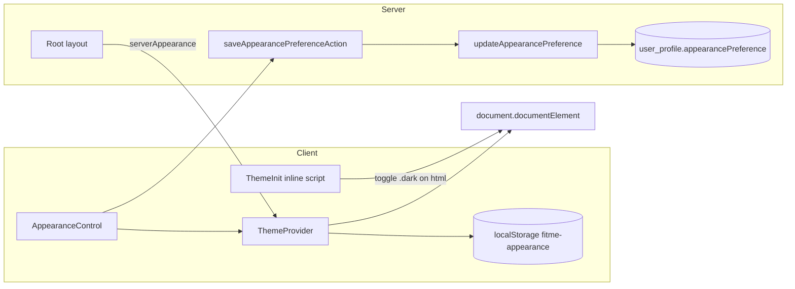

# Architecture Spine — FitMe AI Appearance

## Inherited Invariants

From initiative spine `architecture-FitMe_AI-2026-07-20`:

| Parent AD | Binding here |
| --- | --- |
| AD-1 | Profile reads/writes for `appearancePreference` go through `lib/dal/profile.ts` |
| AD-2 | Profile sync mutation is `saveAppearancePreferenceAction` in `app/actions/appearance.ts` with Zod validation |
| AD-7 | `appearancePreference` lives on `UserProfile`; DAL scopes by authenticated `userId` |
| AD-9 | No appearance values in logs beyond outcome + userId |

## Design Paradigm

**Client-first class-based theme with a blocking FOUC guard, optional profile sync for signed-in users.**

Appearance is a presentation concern: effective theme is resolved on the client from `localStorage` (instant apply) with profile as the server source of truth on first login. No third-party theme library — a thin custom layer keeps bundle size and behavior aligned with FitMe's three-mode MVP.

## Technology Decision: Custom vs next-themes

| Option | Fit | Verdict |
| --- | --- | --- |
| **Custom class toggle** | Three modes only; FOUC script ~1 line; no SSR attribute dance; matches existing Tailwind `@custom-variant dark` | **ADOPTED** |
| `next-themes` | Mature, handles edge cases; adds dependency; `attribute="class"` still needs FOUC script for zero flash | Deferred — revisit if Night + nested themes complicate |

## Invariants & Rules

### AD-A1 — Effective theme is a `dark` class on `<html>`, not media-query-only CSS [ADOPTED]

- **Binds:** all appearance surfaces
- **Prevents:** OS-only dark that ignores user choice; FOUC on dark preference
- **Rule:** Tailwind uses `@custom-variant dark (&:where(.dark, .dark *))`. Semantic tokens live in `:root` and `.dark` in `globals.css`. Components use `dark:` variants; no parallel theme systems.

### AD-A2 — Preference enum is `system | light | dark` everywhere [ADOPTED]

- **Binds:** domain, Prisma, localStorage, UI labels
- **Prevents:** drift between client storage and profile column
- **Rule:** Single source type in `lib/domain/appearance/types.ts`. Invalid stored values normalize to `system`. Prisma enum `AppearancePreference` matches exactly.

### AD-A3 — FOUC guard runs synchronously before first paint [ADOPTED]

- **Binds:** root layout
- **Prevents:** light flash for dark users
- **Rule:** `ThemeInit` injects inline script from `buildAppearanceInitScript()` in `<body>` before React hydration. Precedence: localStorage → server profile fallback (embedded when signed in) → system. Logic must stay in sync with `applyAppearanceToDocument()` in `lib/appearance/browser.ts`.

### AD-A4 — localStorage is the instant-apply source; profile syncs on explicit user change [ADOPTED]

- **Binds:** Settings control, signed-in users
- **Prevents:** round-trip latency on toggle; stale server overriding local choice mid-session
- **Rule:** Key `fitme-appearance`. On segment tap: (1) write localStorage, (2) apply class, (3) fire `saveAppearancePreferenceAction` in a transition. On mount: localStorage wins if present; else seed from profile and write localStorage. Unsigned users: steps 1–2 only; action returns `ok({ profile: null })`.

### AD-A5 — System mode listens to `prefers-color-scheme` changes [ADOPTED]

- **Binds:** `appearance === "system"`
- **Prevents:** stale theme when OS toggles while app is open
- **Rule:** `ThemeProvider` registers `matchMedia` change listener only while preference is `system`.

### AD-A6 — Night mode is a separate phase; do not extend enum until tokens exist [DEFERRED]

- **Binds:** Epic 10 Story 10.4
- **Prevents:** half-implemented fourth mode breaking contrast audits
- **Rule:** MVP ships three modes. Night adds warm token set + fourth enum value in a follow-on migration.

## Seed (current layout)

| Concern | Location |
| --- | --- |
| Domain types + resolve | `lib/domain/appearance/types.ts` |
| Storage key + init script | `lib/appearance/constants.ts`, `init-script.ts` |
| DOM + localStorage | `lib/appearance/browser.ts` |
| React context | `components/theme-provider.tsx`, `theme-init.tsx` |
| Settings UI | `app/(app)/settings/appearance-control.tsx` |
| Server action | `app/actions/appearance.ts` |
| DAL | `lib/dal/profile.ts` → `updateAppearancePreference` |
| Schema | `lib/schemas/profile.ts` → `appearancePreferenceSchema` |
| Migration | `prisma/migrations/20260730120000_profile_appearance/` |

## Deferred

- **Night mode** — warm background tokens, reduced blue light; fourth segment in Settings (Story 10.4).
- **Profile-over-local on login conflict** — MVP: local wins if key exists; future: `updatedAt` comparison if cross-device sync becomes a requirement.
- **next-themes adoption** — only if custom layer grows unwieldy (e.g. nested theme providers, component-level themes).

## Open Questions

None blocking MVP.
